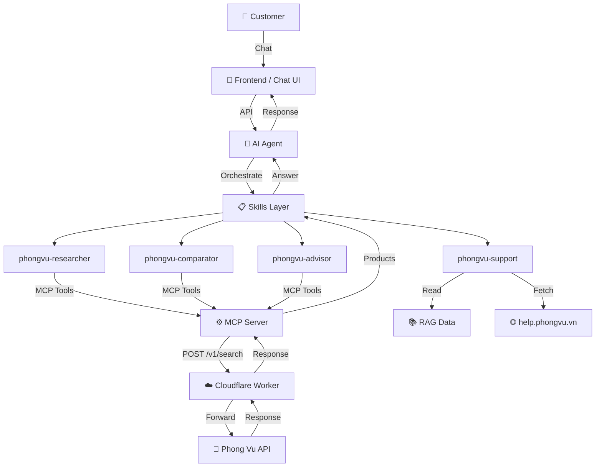
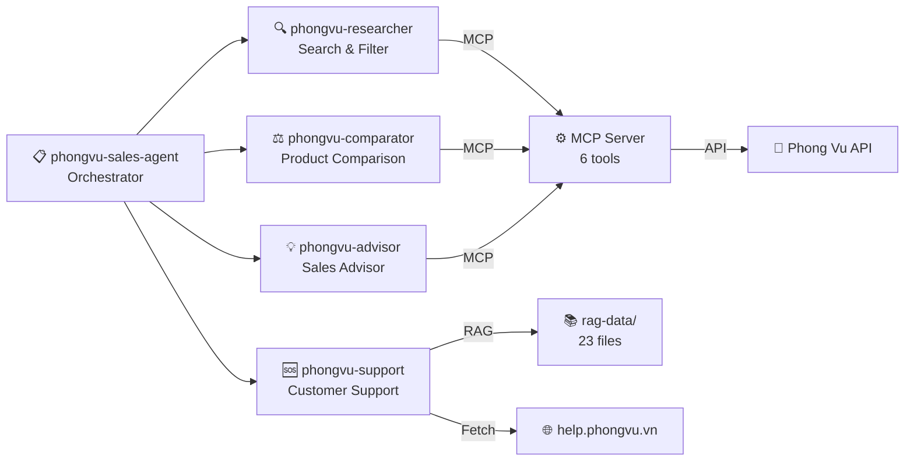
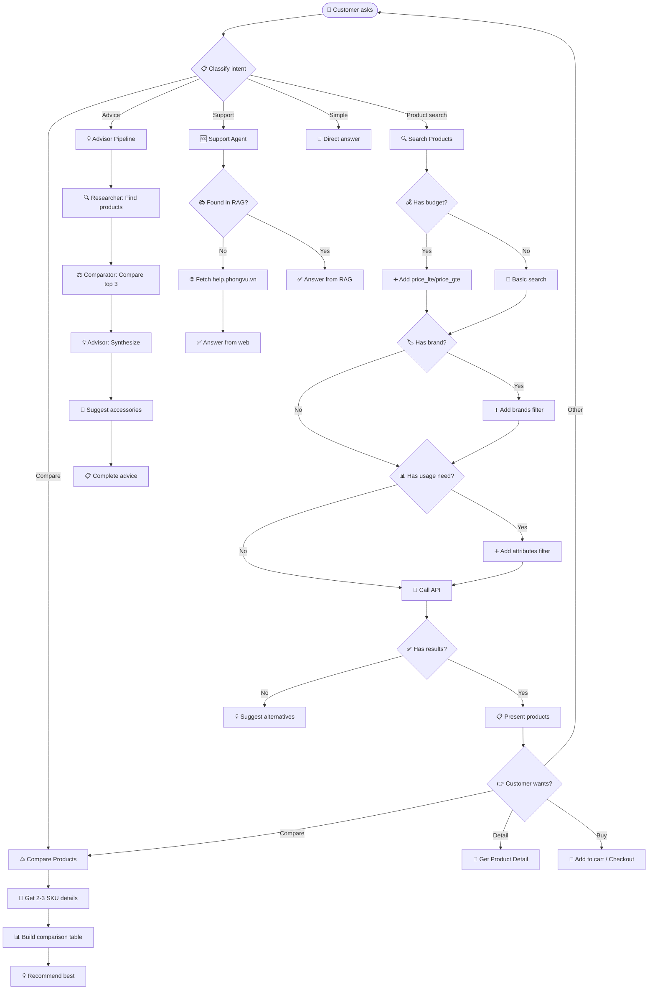
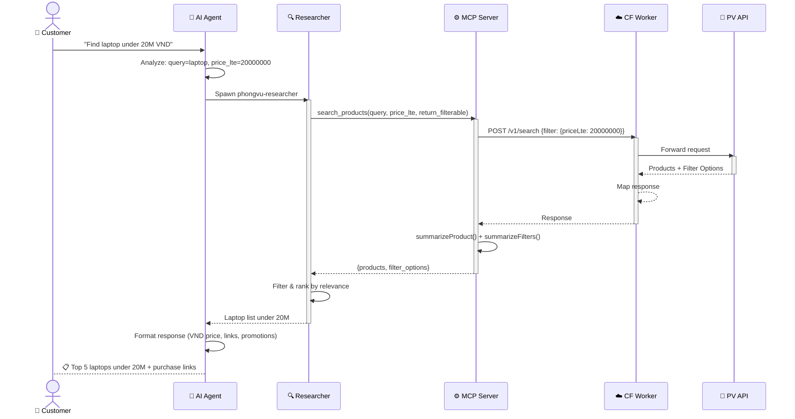
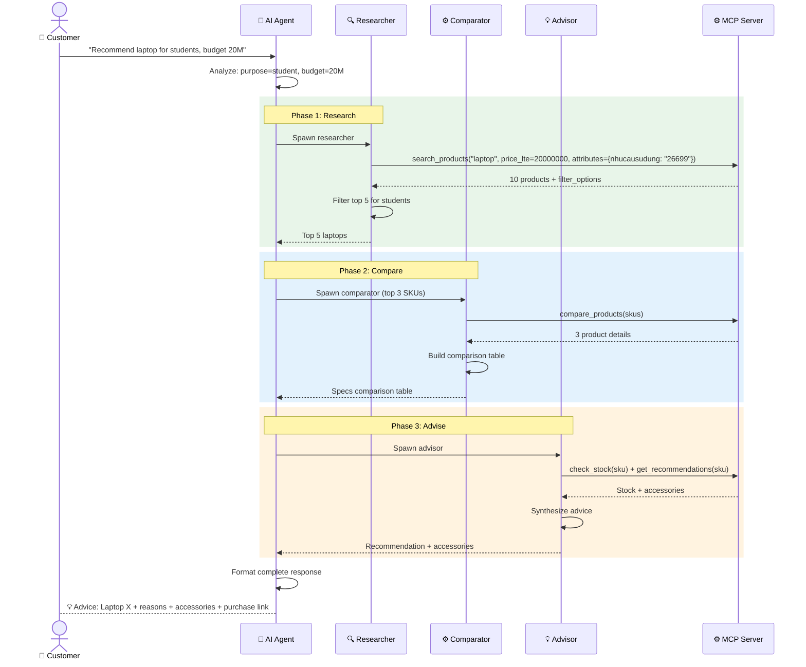
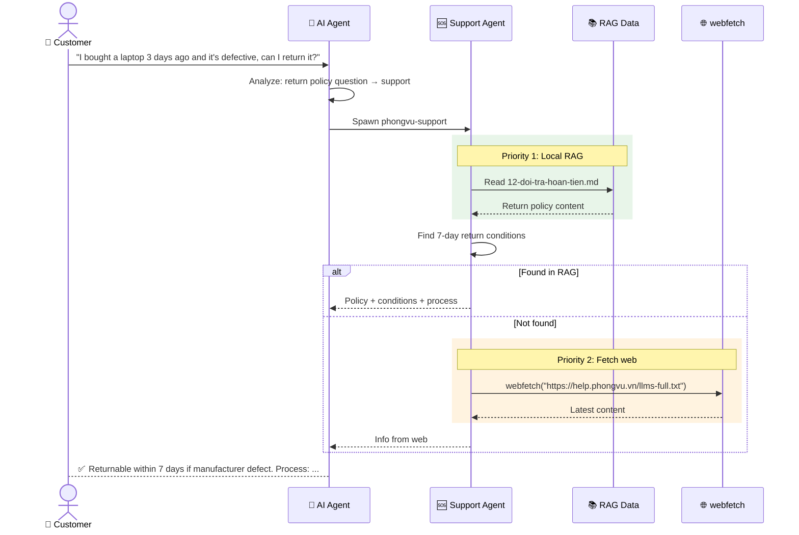
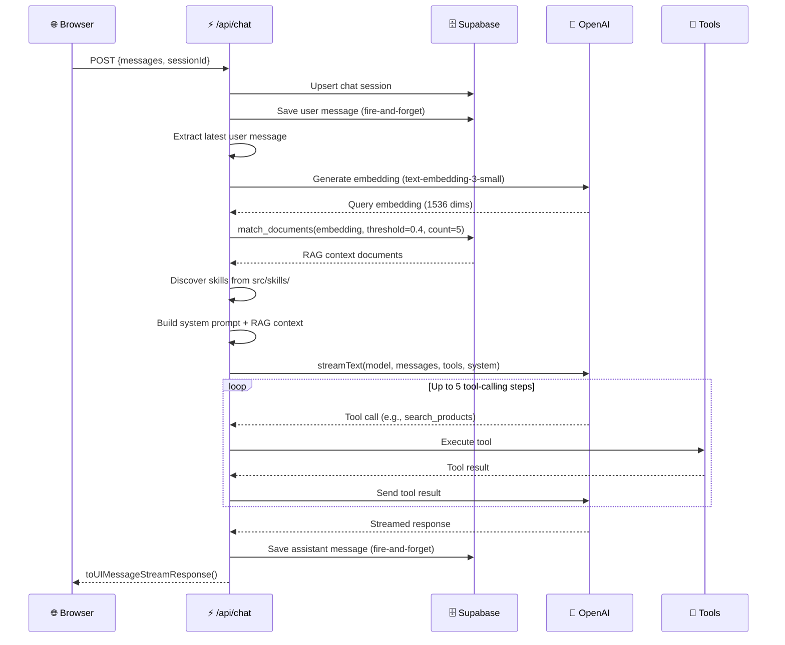
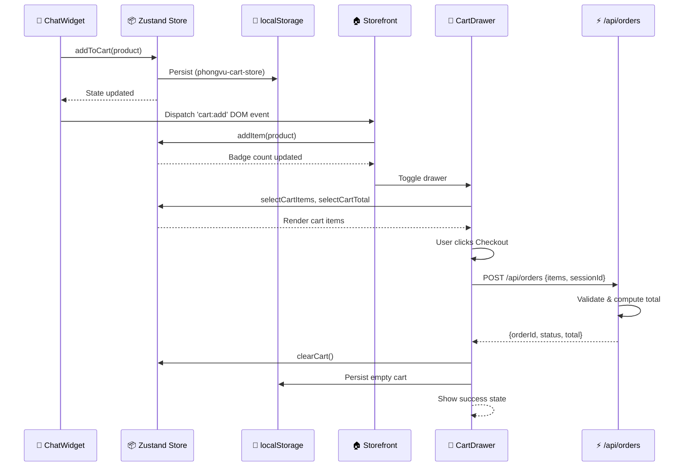
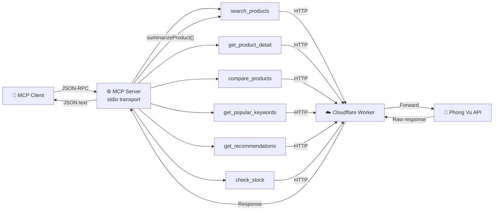

# QuickReply AI — Real-Time AI Sales Agent for E-Commerce

AI-powered conversational sales agent for Phong Vu e-commerce (phongvu.vn). Embeddable chat widget that helps online shoppers search products, compare specs, check live inventory and promotions, and checkout through natural conversation — powered by Vercel AI SDK tool-calling with 7 real-time tools and an on-demand skill system.

## What It Does

- **Real-time product search & comparison** via Phong Vu Discovery API (7 server-side tools)
- **On-demand skill system** — Researcher, Comparator, Advisor, Support loaded dynamically via `loadSkill`
- **Guided checkout** — add to cart and place orders directly in chat
- **Admin dashboard** — conversion rate, AI deflection rate, conversation history, order management
- **MCP server** — standalone tool server (6 tools) compatible with any MCP client
- **Cloudflare Worker proxy** — API security, rate limiting, caching for the Phong Vu API

## Tech Stack

| Category | Technology |
|----------|-----------|
| **Framework** | Next.js 16 (App Router), React 19, TypeScript |
| **AI / LLM** | Vercel AI SDK v7, OpenAI GPT-4o-mini |
| **MCP Server** | @modelcontextprotocol/sdk, Node.js (stdio transport) |
| **API Proxy** | Cloudflare Workers (rate limiting, caching, CORS) |
| **Database** | Supabase (PostgreSQL) |
| **State Management** | Zustand 5 (persist middleware) |
| **Styling** | Tailwind CSS 4, Lucide React, Material Symbols |
| **Validation** | Zod 4 |
| **Testing** | Vitest, Playwright |
| **Deployment** | Vercel (Edge Runtime + Serverless) |
| **Package Manager** | pnpm |

## Architecture

### System Architecture



### Skill Structure



### Business Flow — Intent Classification & Routing



### Sequence Diagram — Product Search



### Sequence Diagram — Full Advisor Pipeline



### Sequence Diagram — Customer Support



### Sequence Diagram — Chat API Request Flow



### Cart Sync Flow



### MCP Server Tool Flow



- **Chat API**: `/api/chat` — Edge Runtime, Vercel AI SDK `streamText`, 7 tools + skill loader
- **Tool calling**: Up to 5 chained steps per turn — `search_products`, `get_product_detail`, `compare_products`, `get_recommendations`, `check_stock`, `get_popular_keywords`, `searchKnowledge`
- **Cart sync**: Zustand store persisted to localStorage, broadcast via custom DOM events between ChatWidget and Storefront
- **Sessions**: Anonymous UUID in localStorage (key `qr_session_id`), no auth for MVP
- **MCP server**: Standalone `phongvu-ai-agent/` submodule exposing 6 tools over stdio transport

## Prerequisites

- Node.js v18+
- pnpm
- Supabase account (or local Supabase CLI)
- OpenAI API key

## Setup

1. **Install dependencies**
   ```bash
   pnpm install
   ```

2. **Configure environment variables**

   Create `.env.local`:
   ```bash
   NEXT_PUBLIC_SUPABASE_URL=your_supabase_project_url
   NEXT_PUBLIC_SUPABASE_ANON_KEY=your_supabase_anon_key
   OPENAI_API_KEY=your_openai_api_key
   ```

3. **Initialize database**

   Option A — Supabase CLI:
   ```bash
   npx supabase db push      # apply migrations from supabase/migrations/
   npx supabase db seed      # seed data from supabase/seed.sql
   ```

   Option B — Supabase SQL Editor:
   ```bash
   # 1. Create tables: supabase/migrations/20260711000000_initial_schema.sql
   # 2. Add orders table: supabase/migrations/20260712000000_add_orders.sql
   # 3. Seed data: supabase/seed.sql
   ```

4. **Start development server**
   ```bash
   pnpm dev
   ```

5. **Open** [http://localhost:3000](http://localhost:3000)

## Commands

| Command | Description |
|---------|-------------|
| `pnpm dev` | Start Next.js dev server |
| `pnpm build` | Production build |
| `pnpm start` | Start production server |
| `pnpm test` | Run unit tests (Vitest) |
| `pnpm lint` | Run ESLint |

## Project Structure

```
quickreply-ai/
├── src/
│   ├── app/
│   │   ├── api/
│   │   │   ├── chat/route.ts        # LLM streaming, tool calling (Edge Runtime)
│   │   │   └── orders/route.ts      # Order creation API
│   │   ├── dashboard/               # Admin dashboard
│   │   │   ├── api/                 # Dashboard API routes (metrics, conversations, orders)
│   │   │   ├── conversations/       # Conversation history page
│   │   │   ├── orders/              # Order management page
│   │   │   ├── layout.tsx           # Dashboard layout with sidebar
│   │   │   └── page.tsx             # Dashboard overview (KPIs, charts)
│   │   ├── globals.css              # Tailwind + design tokens
│   │   ├── layout.tsx               # Root layout (Vietnamese metadata)
│   │   └── page.tsx                 # Storefront homepage
│   ├── components/
│   │   ├── ChatWidget.tsx           # AI chat panel with useChat hook
│   │   ├── CartDrawer.tsx           # Slide-out shopping cart
│   │   ├── ProductCard.tsx          # Product card for chat tool output
│   │   ├── home/                    # Storefront components
│   │   │   ├── TopNavBar.tsx        # Sticky header with search + cart
│   │   │   ├── HeroSection.tsx      # Hero banner
│   │   │   ├── CategoryBar.tsx      # Horizontal category icons
│   │   │   ├── ProductGrid.tsx      # Product grid with filtering
│   │   │   └── HomeFooter.tsx       # Footer
│   │   └── dashboard/               # Dashboard UI components
│   │       ├── MetricCard.tsx       # KPI metric cards
│   │       ├── FunnelChart.tsx      # Conversion funnel
│   │       ├── ConversationTable.tsx # Chat session table
│   │       └── OrderTable.tsx       # Orders table
│   ├── lib/
│   │   ├── supabase.ts              # Supabase client + DB types
│   │   ├── rag.ts                   # OpenAI embeddings + pgvector RPC
│   │   ├── session.ts               # Anonymous UUID in localStorage
│   │   ├── phongvu-api.ts           # Phong Vu Discovery API client
│   │   ├── phongvu-help.ts          # help.phongvu.vn document fetcher + ranker
│   │   ├── phongvu-tools.ts         # AI SDK tool definitions (7 tools)
│   │   ├── products.ts              # Static home page product data
│   │   └── dashboard.ts             # Dashboard data access layer
│   ├── store/
│   │   └── useCartStore.ts          # Zustand cart store with persist
│   └── skills/                      # On-demand AI skills
│       └── phongvu-sales-agent/
│           ├── SKILL.md             # Main sales agent skill
│           ├── phongvu-researcher/  # Product search & filtering
│           ├── phongvu-comparator/  # Product comparison
│           └── phongvu-advisor/     # Sales advisory
├── phongvu-ai-agent/                # Git submodule — MCP server + Cloudflare Worker
│   ├── mcp-server/                  # MCP server (6 tools, stdio transport)
│   ├── cloudflare-worker/           # API proxy (rate limit, cache, CORS)
│   ├── rag-data/                    # 23 help center documents
│   └── skills/                      # MCP-native skill definitions
├── supabase/
│   ├── config.toml                  # Supabase local dev config
│   ├── migrations/                  # Database schema + orders table
│   └── seed.sql                     # RAG knowledge base (23 documents)
├── tests/                           # Vitest test suite
│   ├── rag.test.ts                  # RAG context formatting
│   ├── useCartStore.test.ts         # Cart store unit tests
│   ├── products.test.ts             # Product data validation
│   ├── phongvu-help.test.ts         # Help document parsing + ranking
│   └── home-cart-integration.test.ts # Cart + product integration
└── specs/                           # Spec-driven development artifacts
```

## MCP Server (phongvu-ai-agent)

The `phongvu-ai-agent/` directory is a standalone MCP (Model Context Protocol) server that exposes 6 product tools via `@modelcontextprotocol/sdk` over stdio transport. It connects to the Phong Vu Discovery API through a Cloudflare Worker proxy.

**Tools exposed:**

| Tool | Description |
|------|-------------|
| `search_products` | Search with filters (price, brand, attributes, sort) |
| `get_product_detail` | Full product details by SKU |
| `compare_products` | Side-by-side comparison of 2–3 products |
| `get_popular_keywords` | Trending search terms |
| `get_recommendations` | Related product suggestions |
| `check_stock` | Inventory status and promotions |

**Quick start:**
```bash
cd phongvu-ai-agent/mcp-server
npm install
npm start
```

See [phongvu-ai-agent/README.md](phongvu-ai-agent/README.md) for full documentation.

## Skills System

The on-demand skill system loads specialized markdown instructions dynamically via the `loadSkill` tool. Skills define *how* the AI should approach different customer scenarios:

| Skill | Purpose | Allowed Tools |
|-------|---------|---------------|
| **phongvu-sales-agent** | Main orchestrator — routes intent to sub-skills | All |
| **phongvu-researcher** | Product search & filtering by budget, brand, usage | search_products, get_product_detail, get_popular_keywords |
| **phongvu-comparator** | Side-by-side product comparison with markdown tables | compare_products, get_product_detail, search_products |
| **phongvu-advisor** | Sales synthesis, accessory recommendations, stock check | get_product_detail, get_recommendations, check_stock |
| **phongvu-support** | Customer support via RAG data from help center | webfetch, read, glob, grep |

## Environment Variables

| Variable | Required | Description |
|----------|----------|-------------|
| `NEXT_PUBLIC_SUPABASE_URL` | Yes | Supabase project URL |
| `NEXT_PUBLIC_SUPABASE_ANON_KEY` | Yes | Supabase anonymous key |
| `OPENAI_API_KEY` | Yes | OpenAI API key |
| `OPENAI_BASE_URL` | No | Custom OpenAI base URL (proxy/gateway) |
| `OPENAI_MODEL` | No | LLM model (default: `gpt-4o-mini`) |


Video demo https://youtu.be/JEn_Yp6mLxE

## License

MIT
