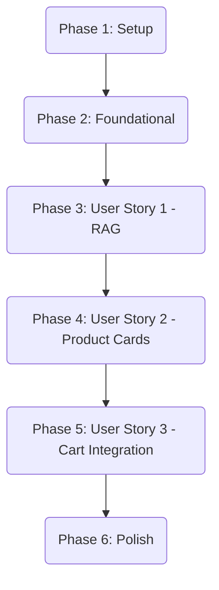

# Tasks: QuickReply AI Storefront & Conversational Sales Agent

**Input**: Design documents from `/specs/001-quickreply-ai/`

**Prerequisites**: [plan.md](file:///E:/source/repos/quickreply-ai/specs/001-quickreply-ai/plan.md) (required), [spec.md](file:///E:/source/repos/quickreply-ai/specs/001-quickreply-ai/spec.md) (required for user stories), [research.md](file:///E:/source/repos/quickreply-ai/specs/001-quickreply-ai/research.md), [data-model.md](file:///E:/source/repos/quickreply-ai/specs/001-quickreply-ai/data-model.md), [contracts/api-chat.md](file:///E:/source/repos/quickreply-ai/specs/001-quickreply-ai/contracts/api-chat.md)

**Tests**: Includes unit tests for the core store/retrieval layers and Playwright E2E tests for the final storefront flow.

**Organization**: Tasks are grouped by phase and user story to enable independent implementation and testing of each story.

---

## Phase 1: Setup (Shared Infrastructure)

**Purpose**: Project initialization and basic workspace structure.

- [x] T001 Create project directories `src/app`, `src/components`, `src/store`, `src/lib`, and `tests/`
- [x] T002 Initialize package.json and install Next.js, Vercel AI SDK Core (`ai`), `@ai-sdk/openai`, `@ai-sdk/elements`, `zustand`, `@supabase/supabase-js`, `lucide-react`, and dev dependencies (`vitest`, `playwright`)
- [x] T003 [P] Configure environment variables and TypeScript configurations in `.env.local` and `tsconfig.json`

---

## Phase 2: Foundational (Blocking Prerequisites)

**Purpose**: Setup the database schema, seeds, client wrapper, and global state store that all user stories build upon.

**⚠️ CRITICAL**: No user story implementation can begin until this phase is complete.

- [x] T004 Create database table schemas with pgvector extension enabled for products, promotions, and warranty policies in Supabase SQL editor
- [x] T005 [P] Seed the Supabase database tables with mock Phong Vu hardware specifications, warranties, and promotions
- [x] T006 Create the Supabase client initialization wrapper in `src/lib/supabase.ts`
- [x] T007 Implement the client-side Zustand store for cart management in `src/store/useCartStore.ts` with LocalStorage persistence
- [x] T008 Implement anonymous session UUID helper in `src/lib/session.ts`

**Checkpoint**: Foundation ready - user story implementation can now begin.

---

## Phase 3: User Story 1 - RAG Hardware & Spec Querying (Priority: P1) 🎯 MVP

**Goal**: Enable customers to ask about hardware specs, warranties, and active promotions with context-aware RAG answers.

**Independent Test**: User opens the chat widget, types "What is the warranty policy for ASUS laptops?", and receives correct details sourced from the database.

### Implementation for User Story 1

- [x] T009 [P] [US1] Create the RAG querying helper in `src/lib/rag.ts` that builds vector query embeddings and retrieves matches from Supabase
- [x] T010 [US1] Implement chat streaming API route in `src/app/api/chat/route.ts` using `@ai-sdk/openai` and Vercel AI SDK Core
- [x] T011 [US1] Create chat widget UI component using `@ai-sdk/react` in `src/components/ChatWidget.tsx`
- [x] T012 [US1] Integrate anonymous session UUID into `src/components/ChatWidget.tsx` payloads sent to the chat API
- [x] T013 [US1] Create mock storefront shell layout in `src/app/page.tsx` and embed the chat widget
- [x] T014 [US1] Implement unit tests for RAG queries and useCartStore in `tests/rag.test.ts` and `tests/useCartStore.test.ts`

**Checkpoint**: At this point, the core RAG Conversational Sales Agent is fully functional.

---

## Phase 4: User Story 2 - Dynamic Product Card Injection (Priority: P2)

**Goal**: Stream interactive, styled React product cards into the chat window when a product recommendation query is resolved.

**Independent Test**: Ask the assistant "Recommend laptops under 30 million VND" and verify that interactive product cards render without layout shifts.

### Implementation for User Story 2

- [x] T015 [P] [US2] Create interactive product card component in `src/components/ProductCard.tsx`
- [x] T016 [US2] Register `queryProducts` tool inside the LLM orchestrator in `src/app/api/chat/route.ts`
- [x] T017 [US2] Stream and render `ProductCard` components inside the `ChatWidget.tsx` message feed via tool calling UI handlers
- [ ] T018 [US2] Implement unit tests for the `ProductCard` component in `tests/unit/ProductCard.test.ts`

**Checkpoint**: At this point, interactive component streaming is complete.

---

## Phase 5: User Story 3 - Add to Cart Trigger from Chat (Priority: P3)

**Goal**: Allow users to click "Add to Cart" directly from streamed chat cards or trigger it programmatically via LLM tool calls, updating the storefront cart instantly.

**Independent Test**: Click "Add to Cart" on a streamed product card and verify the cart count immediately increments on the storefront header.

### Implementation for User Story 3

- [x] T019 [US3] Connect `ProductCard.tsx` Add to Cart button click handler to `useCartStore.ts` action triggers
- [x] T020 [US3] Register the `addToCart` tool inside `src/app/api/chat/route.ts` to allow programmatic adding via text
- [x] T021 [US3] Create slide-out cart panel in `src/components/CartDrawer.tsx` connected to the storefront page layout
- [x] T022 [US3] Add client-side tool execution listener for `addToCart` in `src/components/ChatWidget.tsx`
- [ ] T023 [US3] Write E2E verification test for cart synchronization in `tests/e2e/cart-sync.spec.ts`

**Checkpoint**: Storefront cart synchronization with the agent stream is fully complete.

---

## Phase 6: Polish & Cross-Cutting Concerns

**Purpose**: Error resiliency and final integration sanity tests.

- [x] T024 Implement LLM error handling and 3x silent retry loop in `src/app/api/chat/route.ts` (via `maxRetries: 3`) and `src/components/ChatWidget.tsx` (via `onError` callback)
- [ ] T025 Update documentation and environment variable definitions in `README.md`
- [x] T026 Perform final verification run using `quickstart.md` guidelines

---

## Dependencies & Execution Order

### Parallel Opportunities

Within each story phase:
* **User Story 1 (Phase 3)**: `T009` (RAG helper) is isolated from UI work and can run in parallel with `T011` (Chat widget layout setup).
* **User Story 2 (Phase 4)**: `T015` (ProductCard creation) is isolated from routing work and can run in parallel with `T016` (Tool registration in API endpoint).
